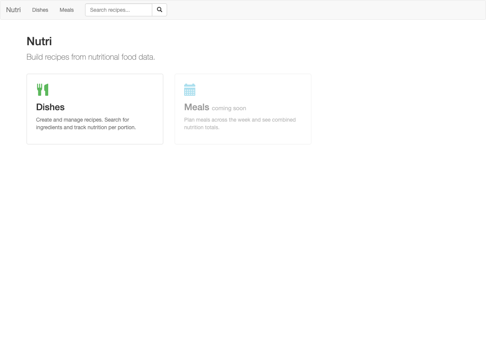
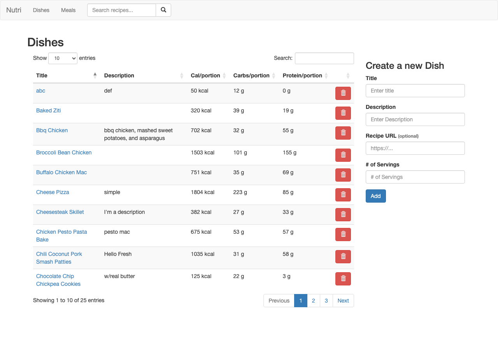
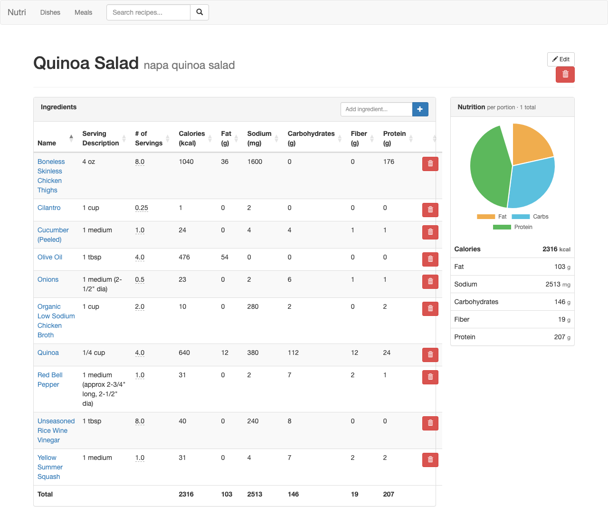
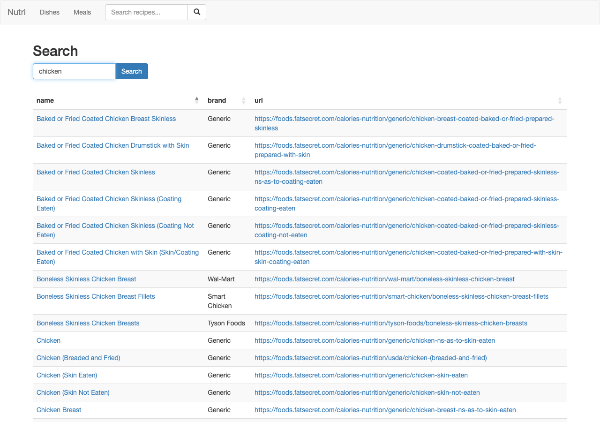

# nutri

Flask app for building dishes (recipes) from nutritional food data sourced via the FatSecret API.

## Screenshots

**Home**


**Dishes**


**Dish detail**


**Ingredient search**


## Setup

```bash
python -m venv .venv
source .venv/bin/activate
pip install -r requirements.txt
cp .env.example .env  # fill in FatSecret API credentials (see below)
flask db upgrade      # apply all migrations
```

FatSecret API credentials can be obtained by registering an application at [platform.fatsecret.com](https://platform.fatsecret.com).

## Run

```bash
flask --app main run --debug
```

## Tests

```bash
python -m pytest tests/ -v
```

No `.env` credentials are needed — tests use an in-memory SQLite database and mock FatSecret API calls.

## Database migrations

```bash
# After changing a model:
flask db migrate -m "describe the change"
flask db upgrade
```
