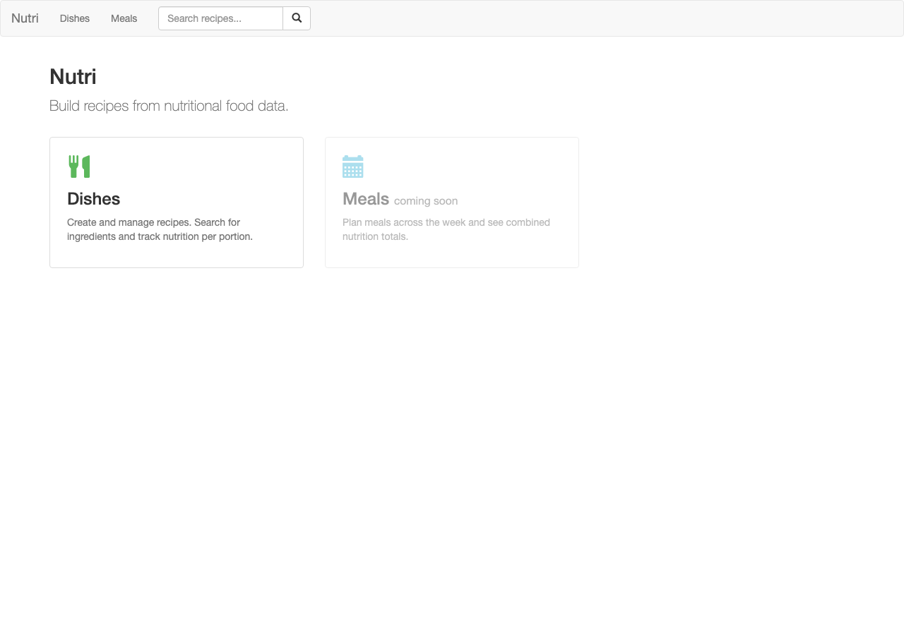
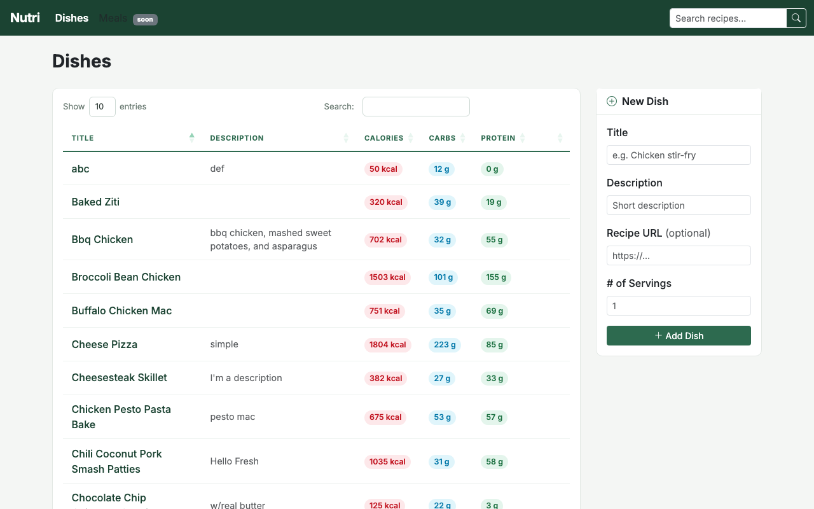
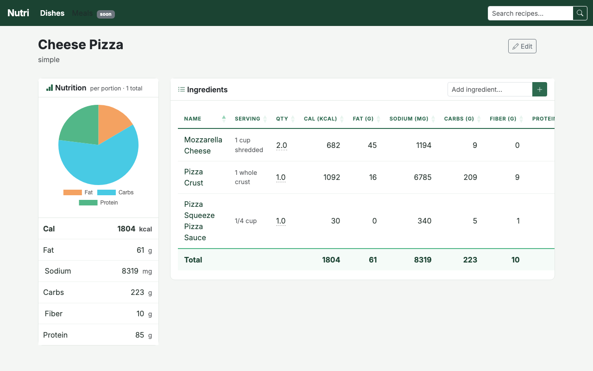
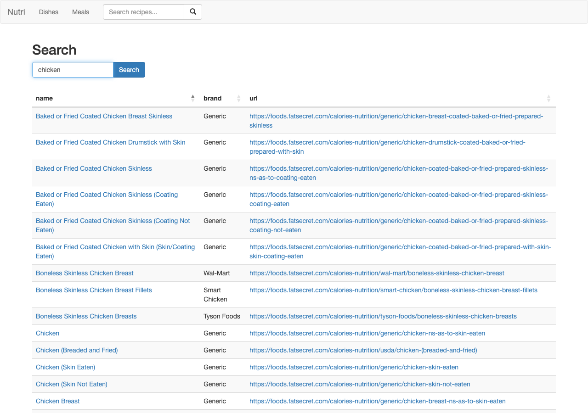

# nutri

Flask app for building dishes (recipes) from nutritional food data sourced via the FatSecret API.

## Screenshots

**Home**


**Dishes**


**Dish detail**


**Ingredient search**


## Setup

```bash
python -m venv .venv
source .venv/bin/activate
pip install -r requirements.txt
cp .env.example .env  # fill in FatSecret API credentials (see below)
flask db upgrade      # apply all migrations
```

FatSecret API credentials can be obtained by registering an application at [platform.fatsecret.com](https://platform.fatsecret.com).

## Run

```bash
flask --app main run --debug
```

## Tests

```bash
python -m pytest tests/ -v
```

No `.env` credentials are needed — tests use an in-memory SQLite database and mock FatSecret API calls.

## Database migrations

```bash
# After changing a model:
flask db migrate -m "describe the change"
flask db upgrade
```

## Self-hosting on Proxmox

The app ships as a Docker image built and pushed to GHCR automatically on every push to `main`. Hosting it on Proxmox takes about 10 minutes to set up.

### 1. Create the LXC container

In the Proxmox web UI (or via `pct`):

- **Template**: Debian 12 (bookworm) — download from the template library if not present
- **Disk**: 4 GB is plenty (SQLite DB will stay well under 100 MB)
- **RAM**: 256 MB minimum; 512 MB recommended
- **CPU**: 1 core
- **Network**: DHCP or a static IP — note the IP, you'll need it for the reverse proxy

Start the container and open a shell (`pct enter <id>` or the Proxmox console).

### 2. Install Docker inside the LXC

```bash
apt-get update && apt-get install -y curl
curl -fsSL https://get.docker.com | sh
```

> If you get cgroup errors, enable nesting in the LXC options:  
> Proxmox UI → Container → Options → Features → check **Nesting**.

### 3. One-time app setup

```bash
# Create app directory
mkdir -p /opt/nutri/instance
cd /opt/nutri

# Download compose.yml
curl -fsSL https://raw.githubusercontent.com/astonshane/nutri/main/compose.yml -o compose.yml

# Create .env with your credentials
cat > .env <<'EOF'
FATSECRET_CLIENT_ID=your_client_id
FATSECRET_CLIENT_SECRET=your_client_secret
SECRET_KEY=change_me_to_a_long_random_string
EOF

# Log in to GHCR (use a GitHub Personal Access Token with read:packages scope)
# Create one at: https://github.com/settings/tokens → New token → read:packages
echo YOUR_PAT | docker login ghcr.io -u astonshane --password-stdin

# Pull and start
docker compose up -d
```

The app is now running on port 8000. The SQLite database lives in `./instance/` on the host and is mounted into the container, so it survives image updates.

### 4. (Optional) Reverse proxy with Caddy

If you want HTTPS or a clean domain name, install Caddy on the LXC (or a separate one) and proxy to port 8000:

```bash
apt-get install -y debian-keyring debian-archive-keyring apt-transport-https curl
curl -1sLf 'https://dl.cloudsmith.io/public/caddy/stable/gpg.key' | gpg --dearmor -o /usr/share/keyrings/caddy-stable-archive-keyring.gpg
curl -1sLf 'https://dl.cloudsmith.io/public/caddy/stable/debian.deb.txt' | tee /etc/apt/sources.list.d/caddy-stable.list
apt-get update && apt-get install -y caddy
```

`/etc/caddy/Caddyfile`:
```
nutri.yourdomain.com {
    reverse_proxy localhost:8000
}
```

```bash
systemctl reload caddy
```

Caddy handles TLS automatically if the domain is publicly reachable. For a local-only setup, just access the app directly at `http://<lxc-ip>:8000`.

### 5. Updating the app

Whenever you push to `main`, GitHub Actions builds a new image and pushes it to GHCR. To deploy the update on the server:

```bash
cd /opt/nutri
docker compose pull && docker compose up -d
```

Migrations run automatically on container start — no manual steps needed.
